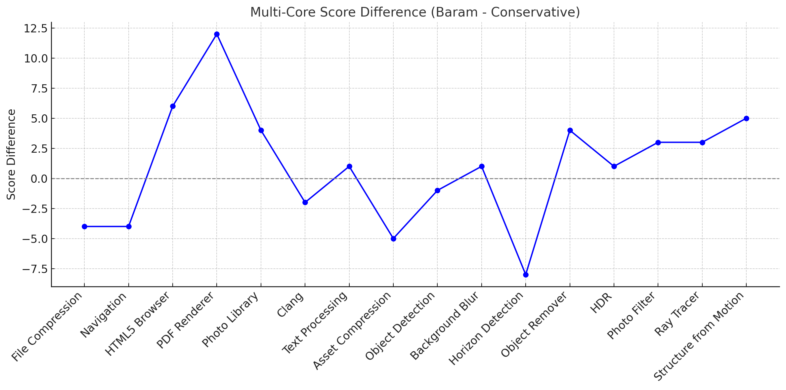

# Baram: An Intelligent, Power-Aware CPU Governor for Laptops

[](https://app.deepsource.com/gh/gg582/laputil/)  
[](https://app.deepsource.com/gh/gg582/laputil/)  
[](https://app.deepsource.com/gh/gg582/laputil/)  

**Baram**is a custom CPU frequency governor built for laptops, designed to balance **performance and battery life** more intelligently than traditional load-based governors.
Instead of reacting only to raw CPU utilization, Baram runs a **lightweight 1D convolutional neural network (CNN)** entirely inside the kernel. The network ingests a short history of normalized load samples and outputs a signed adjustment that nudges the requested frequency toward what the model predicts the workload will need.

## GeekBench 6(compared to conservative)


---

## How It Works: Core Concepts

### 1. Lightweight 1D CNN Forecaster
Baram keeps a fixed-length (16 sample) history buffer of CPU load that is normalized around the configurable `target_load`. Each update runs two tiny convolutional layers (kernel width 3, leaky-ReLU activations) followed by global averaging and a fully connected output. The entire pipeline is implemented with fixed-point math so it remains safe for kernel space yet still captures short-term workload trends.

### 2. History Normalization & Target Tracking
Every sample stored in the CNN buffer represents the deviation from the current `target_load`. When the target changes—either because the system switches power source or the user writes a new value—the history is re-initialised so that the network immediately adapts to the new operating point.

### 3. Hybrid Safety Overrides
The CNN drives the incremental adjustments, but Baram still applies deterministic guard rails. Extremely high load snapshots push the policy straight to the maximum frequency, while near-idle snapshots collapse to the minimum. This prevents the neural network from ever starving the CPU when responsiveness is critical.

### 4. Battery-Aware Gain Scheduling
The same network runs on both AC and battery, but its output is scaled differently. On AC power Baram increases both the frequency step size and the neural output gain for snappy response. On battery the gain is reduced and the frequency steps shrink, trading peak performance for sustained efficiency without retraining the model.

---

## Installation and Usage

### Prerequisites
Install kernel headers and build tools first (Debian/Ubuntu example):  
```bash
sudo apt update
sudo apt install linux-headers-$(uname -r) build-essential
```

### Installation
```bash
su
./scripts/generate_ac_headers.sh
./install.sh
```

### Update
```bash
su
./scripts/generate_ac_headers.sh
./update.sh
```

### Intel CPU Configuration
If the `intel_pstate` driver is active, `acpi-cpufreq` governors cannot run. Disable it:  

1. Edit `/etc/default/grub`.  
2. Add `intel_pstate=passive` to `GRUB_CMDLINE_LINUX_DEFAULT`.  
   Example:  
   ```
   GRUB_CMDLINE_LINUX_DEFAULT="quiet splash intel_pstate=passive"
   ```
3. Update and reboot:  
   ```bash
   sudo update-grub
   sudo reboot
   ```

#### For Intel Meteor Lake Chips
```bash
patch -p1 < lp-e.patch
```

---

## Activating the Governor

### Temporary Activation (until reboot)
```bash
sudo modprobe cpufreq_baram
sudo cpupower frequency-set -g baram
```

### Permanent Activation (at boot)
```bash
echo "cpufreq_baram" | sudo tee /etc/modules-load.d/baram.conf
```
(Optionally set Baram as the default governor using `cpupower-gui`, TLP, or similar tools.)

---

## Tunables (via Sysfs)

Available under:  
`/sys/devices/system/cpu/cpufreq/policy*/baram/`

| Parameter              | Description                                                          | Default |
| ---------------------- | -------------------------------------------------------------------- | ------- |
| `freq_step`            | Step size for frequency change, as % of max frequency               | 5       |
| `sampling_rate`        | Sampling period (seconds)                                           | 1       |
| `sampling_down_factor` | Multiplier applied to sampling rate when scaling frequency down     | 2       |
| `ignore_nice_load`     | Ignore `nice` processes in load calculation (1 = ignore)            | 1       |
| `target_load`          | Load (%) the CNN keeps as its neutral reference                     | 50      |
| `learning_rate`        | Gain applied to the CNN output (scaled in thousandths)              | 200     |

---

## License
This project is licensed under the **GNU General Public License v2.0**.  
